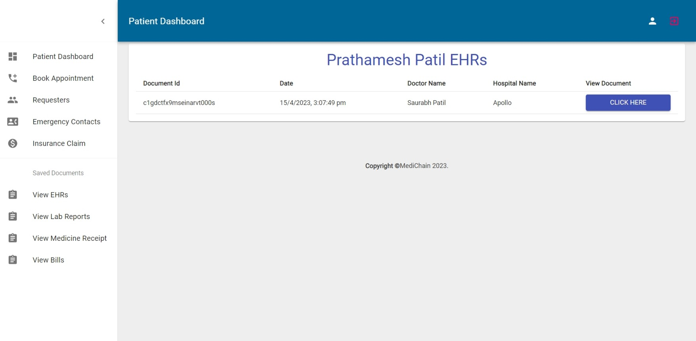
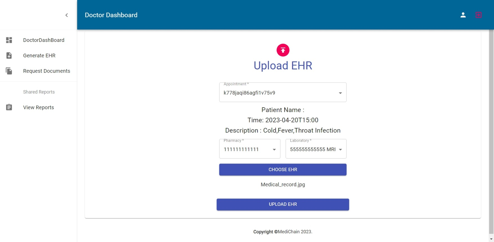
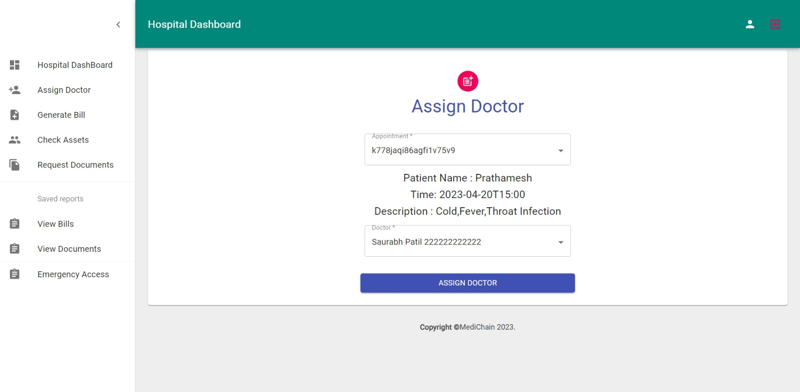
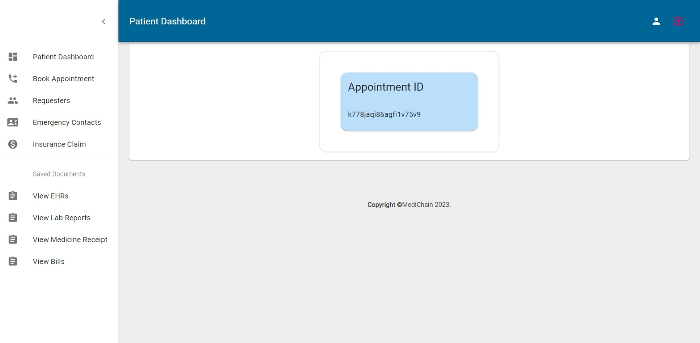
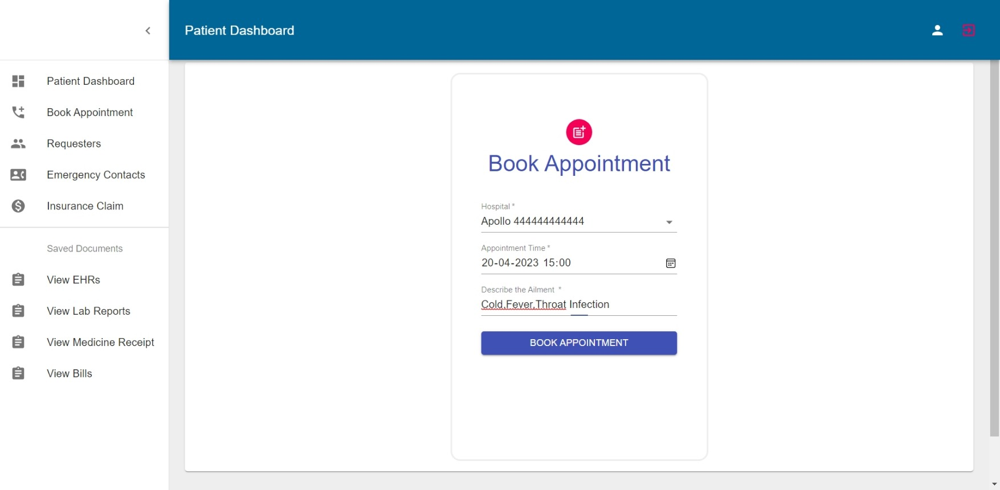

# Medichain - Electronic Health Record System


Medichain is an innovative Electronic Health Record (EHR) system designed to securely store and manage patient health records using blockchain technology. This repository contains the source code and configuration files for the Medichain project.


## Table of Contents

- [Introduction](#introduction)
- [Features](#features)
- [Architecture](#architecture)
- [Getting Started](#getting-started)
  - [Prerequisites](#prerequisites)
  - [Installation](#installation)
  - [Configuration](#configuration)
- [Usage](#usage)
- [Technologies Used](#technologies-used)
- [Images](#images)

## Introduction

Medichain is a cutting-edge electronic health record system that leverages the power of blockchain technology to ensure the security, privacy, and reliability of patient health records. The project utilizes Hyperledger Fabric as the blockchain platform, Express.js and Node.js for the backend, and React with Material-UI and Bootstrap for the frontend. MongoDB is used as the database for storing essential information.

## Features

- **Blockchain Security**: Patient records are stored on a decentralized blockchain using Hyperledger Fabric, ensuring immutability and tamper resistance.
- **User-Friendly Interface**: The frontend is developed using React, Material-UI, and Bootstrap, offering a modern and intuitive user experience.
- **Privacy Control**: Patients and healthcare providers have control over who can access and update their medical information.
- **Data Integrity**: Medical records are digitally signed and timestamped, ensuring the authenticity and integrity of the data.
- **Efficient Data Retrieval**: Smart contracts and blockchain indexing enable quick and secure access to patient records.
- **Audit Trail**: Every change to a patient's record is traceable and auditable, enhancing transparency.

## Architecture

The Medichain project is structured with a multi-tier architecture:

- **Frontend**: The user interface is developed using React, Material-UI, and Bootstrap, providing an elegant and responsive design for users to interact with the system.

- **Backend**: The backend is powered by Express.js and Node.js. It manages user authentication, interacts with the blockchain network, and communicates with the database.

- **Blockchain**: Hyperledger Fabric is employed as the blockchain platform. It ensures secure and transparent storage of patient health records and enforces smart contract logic.

- **Database**: MongoDB is used as the database for storing user profiles, access controls, and metadata.

## Getting Started

### Prerequisites

Before you begin, ensure you have the following software installed:

- Node.js (with npm)
- Docker
- Docker Compose
- MongoDB

### Installation

1. Clone this repository:
   ```
   git clone https://github.com/Tejas-Samel/Medichain.git
   ```

2. Install frontend dependencies:
   ```bash
   cd web-app/client
   npm install
   ```

3. Install backend dependencies:
   ```bash
   cd ../web-app/server
   npm install
   ```

4. Set up MongoDB database and ensure it's running.

5. Install blockchain network Hyperledger Fabric from this website.```https://hyperledger-fabric.readthedocs.io/en/release-2.5/getting_started.html ```
6. Start blockchain network by following instruction:
    ``` cd Blockchain-Network
      install all dependencies from
          fabcar -> javascript
          chaincode -> EHR  
   ```

### Configuration

- Configure backend settings:
  Modify `backend/config.js` to set up your MongoDB connection and other configuration variables.

- Configure frontend settings:
  Modify `frontend/src/config.js` to set your backend API URL.

## Usage

1. Start Blockchain Network:
   ```
   cd Blockchain-Network/fabcar
   ./startFabric.sh
   ``` 
2.  Start the frontend:
   ```bash
   cd client
   npm start
   ```

3. Start the backend:
   ```bash
   cd ../web-app/server
   npm start
   ```

4. Access the Medichain application in your web browser.

## Technologies Used

- Frontend: React, Material-UI, Bootstrap
- Backend: Express.js, Node.js
- Blockchain: Hyperledger Fabric
- Database: MongoDB

## Images









